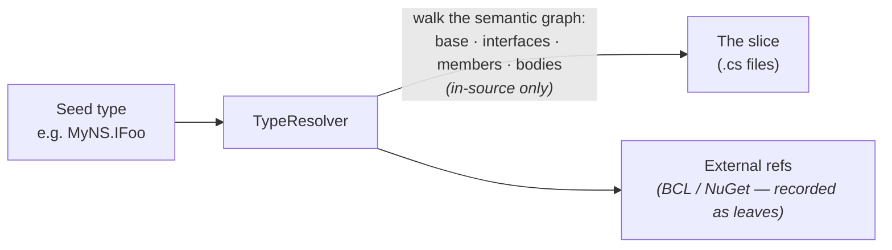

# 𓍋 Chisel

[](https://github.com/JanusMael/chisel/actions/workflows/ci.yml)
[](https://github.com/JanusMael/chisel/actions/workflows/release.yml)
[](https://github.com/JanusMael/chisel/releases/latest)
[](https://www.nuget.org/packages/Bennewitz.Ninja.Chisel)
[](LICENSE)
[](https://dotnet.microsoft.com/download/dotnet/10.0)
[](https://github.com/sponsors/JanusMael)

Carve out the minimal set of C# source files needed to compile a single type — a clean slice of a
larger solution.

Given a fully-qualified type name and a `.sln`, chisel walks the Roslyn **semantic** graph starting
from that type and pulls in every `.cs` file in the codebase required to compile it — across project
boundaries. Code that lives outside the codebase (the BCL, NuGet packages) is treated as a *leaf*:
it is never vendored in, but every external assembly / NuGet package the slice touches is recorded
so a follow-on step can resolve references.



> 📖 New here? The **[Guide](docs/GUIDE.md)** is the deep dive — the dependency walk in detail,
> every output format, source generators, multi-targeting, global usings, and embedding the
> `Core` library.

---

## What it carves out

By default the walk keeps the **declared shape** of the seed and its implementations — the
contract and the data types — but **not** what method bodies *use*. Starting from the seed type it
follows:

- **Base types, interfaces (including inherited ones), and generic constraints / type arguments.**
- **Member signatures** — field/property/event types, method return & parameter types, indexer
  parameters, nested types, and the enclosing type chain of a nested seed.
- **Attributes** — the attribute class plus any `typeof(SomeType)` in constructor or named arguments
  (including arrays of `typeof`).
- **Seed implementations** — when the **seed** is an interface or abstract class, its concrete
  implementations (and, for an interface seed, the base interfaces it derives from) are pulled in.
  Interfaces/classes encountered *deeper* in the graph (e.g. a property's type) are included as
  declarations only — their implementations are **not** expanded.
- **Authored `global using` files** — dedicated global-usings files are kept even though they
  declare no types.

What it deliberately **leaves behind** by default: **method-body usages** (what the kept
types *call* or *instantiate*) and implementations of interfaces reached deep in the graph. This
keeps the slice a focused "contract + shape" extract rather than the whole reachable call graph.

Two knobs widen the walk:

- `--walk-depth bodies` — also follow every type referenced inside method bodies, transitively.
  Produces a **self-compilable** slice, but pulls in far more. (Default `signatures` does not, so a
  default slice may not compile standalone — body-referenced in-source types are treated as
  external.)
- `--expand-impls all` — expand *every* interface/class reached to its implementations, not just the
  seed. (`--expand-impls none`, aliased `--no-derived`, never expands.)

Anything whose containing assembly is **not** one of the solution's projects (BCL, NuGet) is a leaf:
it is recorded in `references.json` and as a `<PackageReference>`, but its source is never pulled into the slice.

---

## Requirements

- **.NET 10 SDK** (pinned via `global.json` to `10.0.300`).
- The target solution should be **restored** so package metadata resolves — either run
  `dotnet restore` yourself, or pass `--restore` to have chisel do it first.

> chisel loads and evaluates your solution with **MSBuild**, which ships with the .NET SDK. The SDK
> is therefore required *at run time*, not just to build chisel — see the note under
> [pre-built binaries](#pre-built-binaries).

---

## Install

### As a .NET tool (recommended)

chisel is packaged as a [.NET tool](https://learn.microsoft.com/dotnet/core/tools/global-tools), so
it installs by name and is invoked as `dotnet chisel …`:

```bash
dotnet tool install --global Bennewitz.Ninja.Chisel
dotnet chisel --version
```

### Pre-built binaries

Each [release](https://github.com/JanusMael/chisel/releases/latest) also publishes self-contained,
per-platform archives:

| Platform | File |
|----------|------|
| Windows (x64) | `chisel-<version>-win-x64.zip` |
| Windows (ARM64) | `chisel-<version>-win-arm64.zip` |
| Linux (x64) | `chisel-<version>-linux-x64.tar.gz` |
| Linux (ARM64) | `chisel-<version>-linux-arm64.tar.gz` |
| macOS (Intel) | `chisel-<version>-osx-x64.tar.gz` |
| macOS (Apple Silicon) | `chisel-<version>-osx-arm64.tar.gz` |

> **These binaries still require a .NET 10 SDK on the machine.** Unlike a typical self-contained
> app, chisel locates and drives the installed SDK's MSBuild at run time (via `MSBuildLocator`); the
> `Microsoft.Build.*` engine assemblies are deliberately *not* bundled. The archives only save you
> the `dotnet tool install` step. Since any machine that can build the solution you're slicing
> already has the SDK, the **.NET tool above is the recommended path**. If no SDK is found, chisel
> exits `7` with an actionable message.

### Build from source

```bash
git clone https://github.com/JanusMael/chisel.git
cd chisel
dotnet build
dotnet run --project src/Chisel.Cli -- --help
```

To install your local build as a tool:

```bash
dotnet pack src/Chisel.Cli -c Release -o ./nupkg
dotnet tool install --global --add-source ./nupkg Bennewitz.Ninja.Chisel
dotnet chisel --version
```

---

## Quick start

```bash
dotnet chisel \
  --type MyNS.IFoo \
  --solution path/to/MySolution.sln \
  --output ./out
```

This writes the artifacts into `./out` (see [Outputs](#outputs)) and prints a summary:

```text
Seed type:     global::MyNS.IFoo
Files:         6
External refs: 3 (1 NuGet packages)
Projects:      4

  files.json       → .../out/files.json
  references.json  → .../out/references.json
  Slice.csproj     → .../out/Slice.csproj
  copied sources   → .../out/src
  .gitignore       → .../out/.gitignore
```

To build the extracted slice on its own:

```bash
dotnet build ./out/Slice.csproj
```

---

## Command-line reference

```text
dotnet chisel --type <FQN> --solution <path.sln> --output <dir> [options]
```

**Required**

| Flag | Description |
|------|-------------|
| `--type`, `-t <FQN>` | Fully-qualified type name. See [type-name formats](#type-name-formats). |
| `--solution`, `-s <path>` | Path to the `.sln` / `.slnx` file. |
| `--output`, `-o <dir>` | Output directory (created if missing). |

**Options**

| Flag | Default | Description |
|------|---------|-------------|
| `--project <name>` | — | Disambiguate when the FQN matches types in multiple projects. |
| `--tfm <name>` | first TFM | Preferred target framework when a project multi-targets. |
| `--walk-depth <d>` | `signatures` | `signatures` (declared shape only) \| `bodies` (also follow method-body usages transitively — self-compilable, larger). |
| `--expand-impls <s>` | `seed` | `seed` (expand only the seed + an interface seed's base interfaces) \| `all` (every interface/class reached) \| `none`. |
| `--no-derived` | — | Alias for `--expand-impls none`. |
| `--source-generators <p>` | `reference` | `skip` \| `materialize` \| `reference` — how to treat generator output. |
| `--exclude`, `-x <path>` | — | Directory subtree to drop from the slice (**repeatable**). Any collected file under `<path>` is logged and left out — handy for vendored/generated/out-of-scope regions. The slice may then be incomplete; each drop is reported as an `Exclude` warning. |
| `--exclude-from <file>` | — | Read exclusion directories from a file, one path per line (**repeatable**; merged with `--exclude`). Use `-` to read from **stdin** (`$paths \| chisel --exclude-from -`). Blank lines and `#` comments are ignored; relative paths resolve against the file's directory (the working directory for stdin). |
| `--allow-partial` | off | Continue when MSBuild reports project-load failures (otherwise fail fast). |
| `--restore` | off | Run `dotnet restore` on the solution before analyzing (best-effort; a failed restore warns and continues). |
| `--format <f>` | `text` | `text` (human summary on stdout) \| `json` (the run manifest on stdout). `result.json` is always written to `--output` regardless. |
| `--strict` | off | Exit nonzero (`6`) if any error-severity diagnostic occurred (default stays `0` on a best-effort run). |
| `--verbose`, `-v` | — | List every diagnostic instead of grouping by stage. |
| `--quiet`, `-q` | — | Console shows only warnings/errors; the full run log is still written. |
| `--no-color` | — | Disable ANSI color (also honored via the `NO_COLOR` env var). |
| `--version`, `-V` | — | Print version and exit. |
| `-h`, `--help` | — | Show usage. |

### Type-name formats

| You type | Resolves to |
|----------|-------------|
| `MyNS.Widget` | the non-generic `Widget` |
| `MyNS.Repository<T>` or `MyNS.Repository<>` | the open generic `Repository<T>` (arity 1) |
| `MyNS.Map<,>` | the open generic with arity 2 |
| `MyNS.Outer.Inner` or `MyNS.Outer+Inner` | the nested type `Inner` |

### Exit codes

| Code | Meaning |
|------|---------|
| `0` | Success |
| `1` | No arguments (usage printed) |
| `2` | Invalid arguments |
| `3` | Type not found / ambiguous (pass `--project`) |
| `4` | Workspace failed to load (try `--allow-partial`) |
| `5` | Solution file not found |
| `6` | Completed with error-severity diagnostics (only under `--strict`) |
| `7` | No .NET SDK / MSBuild found (install the .NET 10 SDK — see [Requirements](#requirements)) |
| `130` | Canceled (Ctrl+C) |

---

## Scripting (PowerShell)

Designed for PowerShell Core 7+. Streams are split for clean capture — **stdout** carries the result
(the text summary, or the manifest under `--format json`), **stderr** carries progress/diagnostics —
and a stable `result.json` is always written. Read it with fully-qualified .NET (no cmdlets, no
piping):

```powershell
& dotnet chisel -t 'Contracts.IShape' -s $sln -o $out --strict
if ($LASTEXITCODE -ne 0) { throw "chisel failed ($LASTEXITCODE)" }

$doc = [System.Text.Json.JsonDocument]::Parse(
    [System.IO.File]::ReadAllText([System.IO.Path]::Combine($out, 'result.json')))
$root = $doc.RootElement
$root.GetProperty('counts').GetProperty('files').GetInt32()
foreach ($p in $root.GetProperty('packages').EnumerateArray()) {
    "$($p.GetProperty('id').GetString()) $($p.GetProperty('version').GetString())"
}
```

Or capture the manifest straight off stdout: `$json = & dotnet chisel … --format json` (progress
still shows on stderr).

> **Generic types in PowerShell:** single-quote any type name containing `<`, `>`, or a backtick —
> `'MyNS.Repository<T>'` or `` 'MyNS.Repository`1' `` (both resolve). `<` is a reserved PS operator
> and the backtick is the PS escape char; single quotes pass them through literally.

See [Exit codes](#exit-codes) to branch on `$LASTEXITCODE`; `--strict` turns any error-severity
diagnostic into a nonzero exit.

---

## Outputs

All of these are written into `--output`.

### `Slice.csproj` — a flat, buildable project

Explicit `<Compile Include>` per collected file (no `ProjectReference`s — the slice is flattened),
plus a `<PackageReference>` per detected NuGet package. Compilation settings (`TargetFramework`,
`LangVersion`, `Nullable`, `ImplicitUsings`, `AllowUnsafeBlocks`, user `DefineConstants`) are hoisted
from the contributing projects — taking the **highest/strictest** value when projects disagree, and
warning you when they do.

```xml
<Project Sdk="Microsoft.NET.Sdk">
  <PropertyGroup>
    <TargetFramework>net10.0</TargetFramework>
    <LangVersion>14.0</LangVersion>
    <Nullable>disable</Nullable>
    <ImplicitUsings>enable</ImplicitUsings>
    <EnableDefaultCompileItems>false</EnableDefaultCompileItems>
  </PropertyGroup>
  <ItemGroup>
    <Compile Include="src/ExternalPackage/MyClass.cs" />
  </ItemGroup>
  <ItemGroup>
    <PackageReference Include="newtonsoft.json" Version="13.0.3" />
  </ItemGroup>
</Project>
```

### `files.json` — the file manifest

```json
{
  "files": [
    {
      "path": "C:\\...\\Shapes\\Composite\\Group.cs",
      "project": "Composite",
      "targetFramework": "net10.0",
      "isGenerated": false,
      "containsSymbols": [ "global::Composite.Group" ]
    }
  ]
}
```

### `references.json` — external references (the follow-on step's input)

NuGet packages and framework assemblies the slice depends on but does **not** vendor:

```json
{
  "packages": [
    {
      "id": "newtonsoft.json",
      "version": "13.0.3",
      "assemblyName": "Newtonsoft.Json",
      "assemblyVersion": "13.0.0.0"
    }
  ],
  "frameworkAssemblies": [
    {
      "name": "System.Runtime",
      "version": "10.0.0.0",
      "path": "C:\\Program Files\\dotnet\\packs\\Microsoft.NETCore.App.Ref\\...\\System.Runtime.dll"
    }
  ]
}
```

### `result.json` — the machine-readable run manifest

Written on **every** run (success *or* fatal), and also printed to stdout under `--format json`. A
single, stable, camelCase object — success flag, exit code, seed, mode, counts, the output paths, the
NuGet packages, and the full diagnostics list — designed to be read directly with `System.Text.Json`
(see [Scripting](#scripting-powershell)).

```json
{
  "schemaVersion": 1,
  "tool": { "name": "chisel", "version": "2026.2.624" },
  "success": true, "exitCode": 0, "elapsedSeconds": 3.1,
  "seed": { "displayName": "global::MyNS.IFoo", "filePath": ".../IFoo.cs" },
  "mode": { "walkDepth": "signatures", "expansion": "seed", "sourceGenerators": "reference" },
  "counts": { "inSourceTypes": 7, "files": 6, "projects": 4, "externalReferences": 3, "packages": 1 },
  "packages": [ { "id": "newtonsoft.json", "version": "13.0.3" } ],
  "diagnostics": [ { "severity": "Warning", "stage": "Walk", "message": "…", "item": "…" } ]
}
```

### `src/…` — copied sources

Every collected `.cs` file, copied under `src/<ProjectName>/…` preserving the path relative to its
project. Files outside their project directory (e.g. `<Link>` items) go under `_linked/<hash>/`;
materialized generator output goes under `_generated/`.

### `.gitignore`

A `.gitignore` is written into the output root so the slice behaves like a normal, self-contained
repo (build artifacts under `bin/`/`obj/` stay untracked). It propagates the analyzed solution's own
`.gitignore` (the nearest one found walking up from the `.sln`); if none exists, a minimal .NET
default is written instead.

### `chisel.log` — the run log

A full, timestamped copy of the run (every phase, diagnostic, and the final summary) is written to
`<output>/chisel.log` via Serilog, **reset on each run**. The console shows the same information with
a clean layout; `--quiet` restricts the console to warnings/errors while the log file still captures
everything, and `--verbose` lists every diagnostic instead of grouping them by stage.

---

## How it works

chisel is a pipeline over Roslyn's **semantic model** (not text search). It opens the solution with
`MSBuildWorkspace`, classifies which assemblies belong to the codebase, resolves the seed type, walks
the dependency graph, collects the contributing files + settings, and emits the slice.

```text
src/Chisel.Core/   library — all slicing logic
src/Chisel.Cli/    thin console host (chisel)
tests/Chisel.Core.Tests/   xUnit tests
tests/Fixtures/    worked-example solutions (also used as tests)
```

For the full walk-through — every stage, the body/signature distinction, source generators,
multi-targeting, global usings, mixed project settings, embedding the `Core` library, and a fuller
FAQ — see **[docs/GUIDE.md](docs/GUIDE.md)**.

---

## Error handling

chisel is **best-effort**: it would rather hand you a mostly-complete slice than nothing. A problem
with one file, symbol, or reference is reported and skipped — it does **not** abort the run.
Diagnostics are streamed to **stderr as they happen** and recapped in an end-of-run summary:

```text
Diagnostics: 0 error(s), 1 warning(s) — the slice was still produced.
  [Warning] TargetFramework: Project 'MultiTarget.csproj' multi-targets (net8.0, net10.0); slicing against 'net8.0'. Pass --tfm to choose.
```

Only four conditions are **fatal** (there is genuinely nothing to produce): no .NET SDK / MSBuild
installed (exit `7`), a missing solution file (exit `5`), a workspace that fails to load without
`--allow-partial` (exit `4`), and an unresolvable/ambiguous seed type (exit `3`). Everything else —
a file that won't bind, a reference that won't resolve, a file that can't be copied — becomes a
non-fatal diagnostic and the run still exits `0` with the slice written.

Failing to open a **non-C# project** (`.proj`, `.vcxproj`, `.fsproj`, `.vbproj`, …) is **not** fatal
even without `--allow-partial`: those projects hold no C# to collect, so the failure is reported as a
warning and the C# projects load normally.

---

## Known limitations

- **`dynamic` and reflection-by-string** (`Type.GetType("…")`, DI string registrations) are not
  statically traceable and are not followed; a warning is emitted when `dynamic` is encountered.
- **Single target framework per run.** Multi-targeted projects are sliced against one TFM (`--tfm`
  to choose); code in `#if` regions for other TFMs is preserved in the copied file but not analyzed.
- **Source generators** default to `reference` (the generated files are skipped and a warning tells
  you the generator must run downstream). Use `--source-generators materialize` to write the
  generated code into the slice for a self-contained result. See the [Guide](docs/GUIDE.md).
- `file`-scoped types cannot be used as the **seed** (they have no addressable metadata name).

---

## Troubleshooting

| Symptom | Fix |
|---------|-----|
| `No .NET SDK was found` (exit 7) | Install the [.NET 10 SDK](https://dotnet.microsoft.com/download/dotnet/10.0) and ensure `dotnet` is on your `PATH`. A self-contained binary still needs it. |
| `Type ... not found` | Check the FQN and arity (`Foo<>` not `Foo`); ensure the solution is restored. |
| `... is ambiguous` (exit 3) | Pass `--project <name>` to pick the declaring project. |
| Workspace load failure (exit 4) | `dotnet restore` the solution; if one project is broken, try `--allow-partial`. |
| Slice misses a type referenced via `dynamic`/reflection | Expected — add it manually (see limitations). |
| Slice won't compile due to a missing generated type | Re-run with `--source-generators materialize`. |

---

## Documentation

| Document | Purpose |
|----------|---------|
| [docs/GUIDE.md](docs/GUIDE.md) | The deep dive: how the walk works, every output format, source generators, multi-targeting, global usings, mixed project settings, embedding the `Core` library, and a fuller FAQ. |
| [CONTRIBUTING.md](CONTRIBUTING.md) | Dev setup, the test-fixture step, coding conventions, and the PR checklist. |
| [LICENSE](LICENSE) | MIT license text. |

---

## Contributing

Contributions welcome — see **[CONTRIBUTING.md](CONTRIBUTING.md)** for the full guide (dev setup, the
test-fixture step, coding conventions, and the PR checklist). Please open an issue before submitting a
pull request for non-trivial changes.

1. Fork the repository
2. Create a feature branch (`git checkout -b feat/my-feature`)
3. Make your changes, including tests
4. Prepare the test fixtures, then run the suite:
   ```bash
   pwsh build/restore-test-fixtures.ps1   # restores the fixture solutions + builds the SourceGen generator
   dotnet test
   ```
5. Submit a pull request

> The example solutions under `tests/Fixtures/` are not part of `Chisel.slnx`, so they must be
> restored before `dotnet test` (the `restore-test-fixtures.ps1` helper does this). See
> [docs/GUIDE.md](docs/GUIDE.md) for the developer guide.

> If you find this tool useful, I accept tips / donations:
>
> ❤️ ~B [](https://github.com/sponsors/JanusMael)

---

## License

MIT © 2026 Brian Bennewitz — see [LICENSE](LICENSE).
