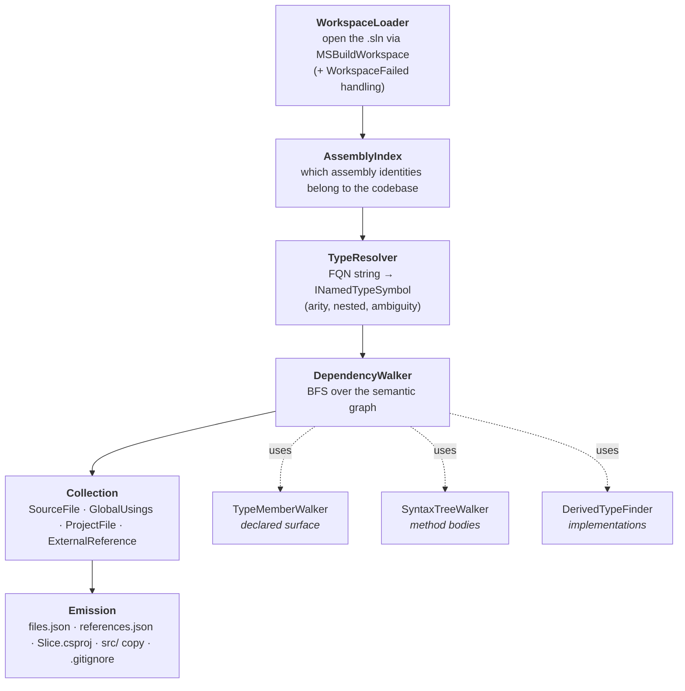

# Chisel — Guide

This guide goes deeper than the [README](../README.md): how the dependency walk works, what each
output contains, how the tricky cases (source generators, multi-targeting, global usings, mixed
project settings) are handled, how to embed the `Core` library, and a fuller FAQ.

---

## 1. Mental model

"Collect the files that define the **shape** of type `T`" and "collect everything needed to
**compile** `T` standalone" are different questions, and the tool can answer either. It uses
Roslyn's **semantic model** rather than text search, and it stops at the boundary of the codebase —
beyond it (the BCL, NuGet packages) code is referenced, not vendored.

- **Default (`--walk-depth signatures`):** collect the *declared surface* — base types, interfaces,
  generic constraints, member signature types, attributes — plus the seed's implementations. This
  is the contract + data-shape extract. It does **not** follow what method bodies *use*, so it is
  smaller and focused, but a body that references an in-source type not otherwise collected won't
  have that type present — i.e. the slice is not guaranteed to compile standalone. (Method bodies
  are still scanned for **external/NuGet references** so the generated csproj carries the packages
  the copied files need — only *in-source* body usages are skipped.)
- **`--walk-depth bodies`:** additionally follow everything method bodies bind to, recursively. A
  type compiles only if everything its declaration *and* its bodies bind to is present, so this mode
  produces a **self-compilable** slice — at the cost of pulling in the whole reachable usage graph.

The result is a **slice**: a flat set of `.cs` files plus a generated `.csproj`, leaving external
dependencies as `<PackageReference>`s.

---

## 2. Architecture

The run is a pipeline. Each stage lives in `src/Chisel.Core/`:



`SliceRunner.RunAsync` orchestrates the pipeline and returns a `SliceResult`.

The CLI (`src/Chisel.Cli/`) is a thin host: `Program.cs` calls
`MsBuildBootstrapper.EnsureRegistered()` **before** any MSBuild type loads, then `CliEntry`
parses args and calls `SliceRunner`.

---

## 3. The walk, in detail

### 3.1 Loading the workspace

`WorkspaceLoader` registers the MSBuild SDK (via `Microsoft.Build.Locator`) and opens the solution
with `MSBuildWorkspace`. It subscribes to `WorkspaceFailed` first:

- **default:** any project-load failure throws `WorkspaceLoadException` (fail fast — an incomplete
  workspace yields an incomplete, silently-wrong slice).
- **`--allow-partial`:** failures are logged as warnings and the run continues with whatever
  loaded.

> Restore the solution first. An unrestored solution produces compilations missing half their
> metadata references, which corrupts the in-source/external classification. Pass **`--restore`**
> to have the tool run `dotnet restore` before opening the workspace (best-effort — a failed
> restore is reported as a warning and the run continues).

### 3.2 Classifying in-source vs external

`AssemblyIndex` builds the set of assembly identities produced by the solution's own projects.
A symbol is **in-source** iff its `ContainingAssembly` is in that set. Everything else — BCL,
NuGet, reference assemblies — is **external** and treated as a leaf. This is what stops the walk
from trying to vendor `System.*` or `Newtonsoft.Json`.

> Building the index means compiling every C# project — the single slowest phase. Projects are
> independent and `GetCompilationAsync` is thread-safe, so this runs **in parallel** (bounded to
> the core count), which also warms the workspace's compilation cache for the resolver and walk.

### 3.3 Resolving the seed

`TypeResolver` turns your `--type` string into an `INamedTypeSymbol`:

- Uses `Compilation.GetTypesByMetadataName` (the plural overload — the singular silently returns
  `null` on ambiguity).
- Normalizes input: strips `<…>` and infers backtick **arity** (`Foo<>` → `` Foo`1 ``,
  `Map<,>` → `` Map`2 ``); converts `Outer.Inner` to the metadata form `Outer+Inner`.
- If still unresolved, falls back to a declaration search by short name.
- If multiple genuinely-distinct projects declare the name, throws `TypeResolutionException`
  listing the candidates — pass `--project <name>` to disambiguate. (Multi-target duplicates of the
  *same* logical type are collapsed first, so they don't trigger a false ambiguity.)

### 3.4 BFS over the graph

`DependencyWalker` keeps a deduplicating worklist (`SymbolWorklist`) of named types, normalized to
`OriginalDefinition` so `List<int>` and `List<string>` collapse to one entry (type **arguments**
are decomposed and enqueued separately). For each dequeued in-source type it runs:

**`TypeMemberWalker` — the declared surface (always):**
base type, all interfaces (including inherited), type parameters + their constraint types, type
arguments, and for every member: field/property/event types, method return + parameter types,
indexer parameters, generic method type parameters, nested types, the enclosing type chain, and all
attributes (including `typeof(...)` constructor/named arguments and arrays thereof). This is the
**default** collection boundary: the type's declared shape.

**`SyntaxTreeWalker` — method bodies:**
for each declaring syntax tree, it walks `DescendantNodesAndSelf()` and calls
`GetTypeInfo`/`GetSymbolInfo` on every node. This uniformly catches object creations, invocations,
member access, generic call-site arguments, `typeof`/`nameof`, casts, patterns, `foreach`,
extension-method containers, user-defined operators/conversions, and implicit conversions (via
`ConvertedType`). `dynamic` is flagged (it can't be traced) and skipped. Each discovered type is
handed to a callback, and the **walk depth decides what the callback keeps**:
- **`--walk-depth bodies`:** every referenced type is enqueued (transitive in-source collection →
  self-compilable slice, at the cost of the whole reachable call graph).
- **default `signatures`:** bodies are still scanned, but the callback keeps only **external/NuGet**
  references (so the csproj has the packages the copied bodies need); in-source body usages are
  dropped, which is what keeps the slice from fanning out. The trade-off: a `signatures` slice may
  not compile standalone (in-source types used only inside bodies are left to be supplied as
  references).

`SymbolWorklist` decomposes arrays (element type), pointers (pointed-at type), function pointers
(signature return + parameter types), and nullable value types (`Nullable<T>` → `T`). Type
parameters and `dynamic` are correctly *not* enqueued as concrete types.

**`DerivedTypeFinder` — polymorphic expansion (scoped by `--expand-impls`, default `seed`):**
when an *eligible* type is an interface, `SymbolFinder.FindImplementationsAsync` (transitive) plus
`FindDerivedInterfacesAsync` enqueue every concrete implementation and derived interface across the
solution; for a non-sealed class, `FindDerivedClassesAsync` enqueues subclasses.

- **`seed` (default):** only the seed — and, for an interface seed, the base interfaces it derives
  from — are eligible. An interface reached *deeper* (e.g. a property's type) is collected as a
  declaration but **not** expanded to its implementations.
- **`all`:** every interface/class reached is eligible (the old behavior; maximal, slowest).
- **`none`** (alias `--no-derived`): never expand.

Expansion is the most expensive part of the walk (each eligible interface triggers a `SymbolFinder`
scan), so the default `seed` scope is much faster than `all`. The scan itself is also **narrowed**:
an implementer must reference the assembly that declares the type, so the search is restricted to
the declaring project plus its reverse-dependency closure rather than the whole solution.

### 3.5 Excluding paths (`--exclude`, `--exclude-from`)

After collection, before projects and global-usings are derived, any collected file that lives under
an `--exclude <path>` directory subtree is **dropped and logged**. The flag is repeatable; each value
is resolved to an absolute path. Use it to carve out regions you don't want vendored into the slice —
generated code, a vendored third-party tree, or a subsystem you'll supply separately.

- Matching is full-path, recursive, and honors the host's path case-sensitivity
  (`PathComparison`). It is robust against the prefix trap: excluding `…/foo` does **not** match the
  sibling `…/foobar`.
- Each dropped file is reported as a non-fatal **`Exclude`** warning (stage `Exclude`), so it flows
  to stderr live, the run log, the grouped diagnostics summary, and `result.json`. Because `--strict`
  escalates only *error*-severity diagnostics, an intentional exclusion still exits `0`.
- Filtering happens at the collection boundary, so a project whose only collected file was excluded
  simply stops contributing (no empty project, no harvested global-usings from it).
- This can make the slice **incomplete** — that's the explicit intent. If the excluded files were
  needed to compile, the resulting `Slice.csproj` may not build; the warnings tell you exactly what
  was left out.

```bash
# Drop two subtrees; everything under them is logged and omitted.
chisel -t MyNS.Service -s App.sln -o ./slice \
  --exclude ./src/Generated \
  -x ./vendor/ThirdParty
```

When the list is long, keep the paths in a file and pass `--exclude-from` instead (repeatable, and
merged with any `--exclude` flags). One path per line; blank lines and lines starting with `#` are
ignored, surrounding quotes are stripped, and **relative** lines resolve against the file's own
directory (absolute lines are used as-is) — so the file travels with the project it describes.

```bash
chisel -t MyNS.Service -s App.sln -o ./slice --exclude-from ./chisel-excludes.txt
```

Pass `-` to read the list from **stdin** instead of a file — the idiomatic PowerShell pipe (relative
lines then resolve against the working directory):

```powershell
$excludes | chisel -t MyNS.Service -s App.sln -o ./slice --exclude-from -
```

> `-` requires something actually piped into stdin. In an interactive console — including running
> under an IDE/debugger such as **Rider**, where stdin is interactive and never sends EOF — a stdin
> read would otherwise hang. chisel detects this and exits with a clear error; **use a file path
> (`--exclude-from .\excludes.txt`) when running in an IDE/debugger.**

```text
# chisel-excludes.txt — directories to keep out of the slice
src/Generated
vendor/ThirdParty
C:\shared\Allos.Core\TypedCache   # absolute paths work too
```

---

## 4. Outputs in depth

### `Slice.csproj`

- One `<Compile Include>` per collected file, paths relative to the output dir, `/`-separated.
- `<EnableDefaultCompileItems>false</EnableDefaultCompileItems>` so only the explicit includes
  compile (no accidental double-include from the SDK glob).
- No `ProjectReference`s — cross-project sources are flattened into one assembly.
- `<PackageReference>` per detected NuGet package, highest **semantic** version when projects
  disagree (`10.0.0` beats `9.0.0`, which string ordering gets wrong).
- Hoisted settings: see [§7](#7-mixed-project-settings).
- `DefineConstants` includes only **user-defined** symbols; SDK-injected ones (`DEBUG`, `TRACE`,
  the `NET*`/`NETCOREAPP`/platform monikers) are stripped because the SDK re-injects them at build
  time — re-emitting them would pin the slice to Debug and to one TFM's guards.

### `files.json`

Sorted by project then path. Each entry: `path`, `project`, `targetFramework`, `isGenerated`, and
`containsSymbols` (the fully-qualified symbols whose declaration lives in that file). A
global-usings file appears with an empty `containsSymbols`.

### `references.json`

Two arrays. `packages` (NuGet — `id`, `version`, `assemblyName`, `assemblyVersion`) is the input
to a follow-on "resolve the libraries" step. `frameworkAssemblies` (no NuGet origin — `name`,
`version`, on-disk `path`) covers the shared framework. The NuGet `id`/`version` are parsed from
the `.nuget/packages/<id>/<version>/lib/...` path of the metadata reference.

### `src/…`

Physical copy preserving structure under `src/<ProjectName>/`. Out-of-project files (`<Link>`
items) land under `_linked/<hash-of-original-dir>/` so same-named files from different directories
never clobber; materialized generator output lands under `_generated/`. Path comparisons respect
the host OS's case sensitivity.

---

## 5. Source generators

`GetCompilationAsync` on a workspace project includes generator output, so generated **symbols are
discovered** by the walk like any other in-source symbol — *provided the walk reaches them*. A
generated type referenced only inside a method body is therefore discovered only under
`--walk-depth bodies`; under the default `signatures` depth, body-only usages (generated or not) are
out of scope. What happens to the generated *files* once reached is controlled by
`--source-generators`:

| Policy | Behavior |
|--------|----------|
| `reference` (default) | Generated files are **not** copied. A warning notes the slice won't compile unless the generator runs against it downstream. Best when you intend to keep the generator in the consuming build. |
| `materialize` | The generator's output **text** is written into the slice under `_generated/`, producing a self-contained slice that compiles **without** the generator. |
| `skip` | Generated files are omitted, same as `reference` but without the "re-run downstream" intent. |

Generated files are identified authoritatively via `Project.GetSourceGeneratedDocumentsAsync()`
(not guessed from paths), so this works even when `<EmitCompilerGeneratedFiles>true</…>` writes
them to `obj/`.

> SDK-generated *implicit* global-usings (`obj/.../<Proj>.GlobalUsings.g.cs`) are deliberately
> **not** collected — the slice regenerates them via `<ImplicitUsings>enable</…>`, and copying them
> in would duplicate `global using` directives (CS0105).

---

## 6. Multi-targeting

A project with `<TargetFrameworks>net8.0;net10.0</TargetFrameworks>` loads as multiple `Project`
instances sharing one `.csproj`. Before resolution, these are collapsed to a single variant:

- `--tfm <name>` keeps the matching variant (warns + falls back to the first if none matches);
- otherwise the first variant is kept and a warning lists the available TFMs.

The slice is therefore **single-TFM**. Code inside `#if NET8_0` regions for a non-selected TFM is
preserved verbatim in the copied file but is not analyzed, so it won't drag in extra dependencies.

---

## 7. Global usings

An authored `global using` declares no types, so the type-graph walk never reaches a file just for
carrying one — yet collected files may bind to it (`global using System.Text;` makes `StringBuilder`
resolve with no local `using`). `GlobalUsingsCollector` therefore **harvests the `global using`
directives** from every authored (non-generated) file in the contributing projects — whether in a
dedicated `GlobalUsings.cs` *or* mixed in alongside a type — and re-emits the distinct set as one
synthesized file (`src/_generated/GlobalUsings.cs`). Directives already present in a verbatim-copied
file are excluded, so nothing is duplicated (no `CS0105`). Generated/`obj` files are excluded (see
[§5](#5-source-generators)).

> Because directives are harvested (not whole files copied), a `global using` co-located with a type
> the slice doesn't otherwise need is still captured — without dragging that unrelated type in.
> SDK-generated *implicit* global usings remain excluded; the slice regenerates them via
> `<ImplicitUsings>`.

---

## 8. Mixed project settings

A slice can span projects with different `LangVersion`, `Nullable`, `ImplicitUsings`,
`AllowUnsafeBlocks`, etc. They are flattened into **one** csproj, so `CsprojGenerator` picks the
value most likely to let *every* file compile:

| Setting | Strategy |
|---------|----------|
| `LangVersion` | **max** — newer-version source won't compile under an older `LangVersion`. |
| `Nullable` | **strictest** (`Enable` > `Annotations` > `Warnings` > `Disable`) — keeps nullable annotations valid (avoids CS8632). |
| `ImplicitUsings` | **any** — if any project enables it, files from that project rely on it. |
| `AllowUnsafeBlocks` | **any** — enabled if any project needs it. |
| `TargetFramework` | the baseline (first) project's TFM. |

When contributing projects disagree on a setting, a **warning** is emitted (surfaced in
`SliceResult.Warnings` and printed by the CLI) so you can sanity-check the result.

---

## 9. Embedding the `Core` library

The slicing logic is a library; the CLI is optional. Reference `Chisel.Core` and:

```csharp
using Bennewitz.Ninja.Chisel;
using Bennewitz.Ninja.Chisel.Workspace;

// MUST run before any MSBuild/Roslyn-workspace type loads (CLR resolves assemblies at JIT time).
MsBuildBootstrapper.EnsureRegistered();

// Optional second arg: a live diagnostics callback invoked as problems occur (see §11).
var result = await SliceRunner.RunAsync(
    new SliceOptions(
        SolutionPath: @"C:\repo\MySolution.sln",
        TypeName:     "MyNS.IFoo",
        OutputDirectory: @"C:\out",
        // optional:
        ProjectFilter: null,
        PreferredTargetFramework: null,
        WalkDepth: WalkDepth.Signatures,
        ImplementationExpansion: ImplementationExpansion.SeedOnly,
        SourceGenerators: SourceGeneratorPolicy.Reference,
        AllowPartial: false),
    onDiagnostic: d => Console.Error.WriteLine(d.Format()));

foreach (var f in result.Files)       Console.WriteLine($"{f.ProjectName}: {f.AbsolutePath}");
foreach (var r in result.ExternalReferences) Console.WriteLine($"ref: {r.AssemblyName} ({r.PackageId})");
foreach (var d in result.Diagnostics) Console.WriteLine(d.Format());
```

`SliceResult` exposes `SeedTypeDisplay`, `Files`, `ExternalReferences`, `Projects`, `Warnings`
(warning-severity messages, kept for convenience), `Diagnostics` (the structured superset — see
§11), and the output paths (`FileListPath`, `ReferenceManifestPath`, `CsprojPath`,
`CopiedSourceRoot`, and `GitignorePath` — the propagated/default `.gitignore`, or null if it
couldn't be written).

**Exceptions to handle:** `TypeResolutionException` (has `Candidates` for disambiguation UIs),
`WorkspaceLoadException` (has `Diagnostics`), and `FileNotFoundException` (missing solution).

> Call `MsBuildBootstrapper.EnsureRegistered()` once per process; it is idempotent and guards the
> ordering requirement. Keep the method that first touches `MSBuildWorkspace` separate from the
> entry point so the assembly load doesn't happen before registration. `EnsureRegistered()` throws
> `InvalidOperationException` (`MsBuildBootstrapper.NoSdkMessage`) when no SDK/MSBuild is installed;
> a host that prefers a clean message + exit code over an exception can call
> `MsBuildBootstrapper.TryEnsureRegistered(out var error)` instead (this is what the CLI does — it
> maps the failure to exit 7).

---

## 10. Limitations

- **`dynamic` / reflection-by-string** are not statically traceable; references made only through
  them are not collected (a warning is emitted for `dynamic`).
- **Single TFM per run** (see [§6](#6-multi-targeting)).
- **`file`-scoped types** can't be the seed — they have no addressable metadata name. (They are
  fine as *dependencies*.)
- The slice trusts that contributing projects' settings can be reconciled into one csproj; the
  disagreement warnings ([§8](#8-mixed-project-settings)) flag when that assumption is stretched.

---

## 11. Error handling & diagnostics

The pipeline is **best-effort**. The guiding principle: a problem with one *item* (a file, a
symbol, a reference) is reported and skipped, not allowed to abort the whole slice. You get a
mostly-complete slice plus a clear account of what went wrong, rather than nothing.

**Fatal vs. non-fatal.** Only three conditions throw — because without them there is nothing to
produce:

| Condition | Exception | CLI exit |
|-----------|-----------|----------|
| Solution file not found | `FileNotFoundException` | 5 |
| Workspace fails to load (no `--allow-partial`) | `WorkspaceLoadException` | 4 |
| Seed type unresolvable / ambiguous | `TypeResolutionException` | 3 |

One condition is checked **before** the pipeline even starts: if no .NET SDK / MSBuild can be
located, the CLI prints an actionable message and exits **7** (see [§9](#9-embedding-the-core-library)
for the embedding equivalent). This is a pre-flight environment check, not a `SliceRunner` failure.

Note the workspace-load row is narrower than it looks: failing to open a **non-C# project**
(`.proj`, `.vcxproj`, `.fsproj`, `.vbproj`, …) is treated as benign — those projects contain no
C# to collect, so `WorkspaceLoader` classifies the failure by the project file's extension, keeps
it as a warning, and only a failed `.csproj` (or any non-project load error) trips the fatal path.

Everything else is a non-fatal `SliceDiagnostic` (`Warning` or `Error`) carrying a `Stage`, a
`Message`, and the `Item` involved. Stages that degrade gracefully include: per-project compilation
in the assembly index, per-type member/body/derived walking, per-node binding in method bodies,
per-file source collection and global-usings parsing, per-project settings reads, per-reference
NuGet resolution, per-file copying, and each artifact write. A failure in any one of these records
a diagnostic and moves on.

One stage is a **deliberate** warning rather than a recovered failure: stage `Exclude` records each
file dropped by an [`--exclude`](#35-excluding-paths---exclude) path. It's a `Warning` (so it stays
visible and doesn't trip `--strict`, which escalates only errors), flagging that the slice was
intentionally narrowed and may be incomplete.

**Where they surface.**

- **Live, during execution** — pass an `Action<SliceDiagnostic>` to `SliceRunner.RunAsync`; it's
  invoked as each diagnostic occurs. The CLI wires this to **stderr**.
- **At the end** — `SliceResult.Diagnostics` is the full, de-duplicated list; the CLI prints a
  recap (`N error(s), M warning(s) — the slice was still produced`) to stdout.

**Exit code.** A run that produces a slice exits **0 even if it recorded non-fatal errors** — the
errors are advisory, surfaced loudly, but by design do not "fail the flow." Check
`SliceResult.Diagnostics` (or the stderr stream) if you want to gate on them yourself.

The `DiagnosticSink.Guard` / `GuardAsync` helpers implement the pattern: run a per-item operation,
turn any exception into an `Error` diagnostic, and continue — **except** `OperationCanceledException`,
which always propagates so cancellation works normally.

**Progress reporting.** Separate from diagnostics, `RunAsync` takes an optional
`Action<SliceProgress> onProgress`. Each `SliceProgress` is either a **`Phase`** (a coarse milestone
— loading, analyzing projects, resolving, walking, collecting, writing — with running counts) or an
**`Activity`** (fine-grained "what's in flight right now", e.g. `walking Foo` or `finding
implementations of Bar`, emitted per type). The CLI prints phases timestamped to stderr and advances
its heartbeat clock; activities are *not* printed but refresh the current label, so the `… still
working` heartbeat (every five seconds during long, opaque phases — the MSBuild load, the
implementation scans) shows **what the tool is chewing on**, not just that it's alive. stdout is
reserved for the final result summary.

## 12. FAQ

**Why did slicing an interface pull in classes I didn't expect?**
Seed expansion ([§3.4](#34-bfs-over-the-graph)): the seed interface's implementations are collected
by default. If you also got types those concretes *use*, you're on `--walk-depth bodies`; the
default `signatures` collects only the declared shape. Use `--expand-impls none` (alias
`--no-derived`) for the literal closure with no implementations.

**The slice is huge / slower than a rebuild.**
You're likely on `--walk-depth bodies` (the self-compilable mode), which follows the whole reachable
usage graph. The default `--walk-depth signatures` with `--expand-impls seed` collects only the
contract + data shape and is far smaller and faster.

**Why is a NuGet package's source not in the slice?**
By design — packages are leaves. They're recorded in `references.json` and as `<PackageReference>`
for a follow-on resolution step.

**The slice won't compile because a generated type is missing.**
Re-run with `--source-generators materialize` ([§5](#5-source-generators)).

**The slice won't compile because a type the code uses via `dynamic` is missing.**
Expected — add it manually; `dynamic` can't be traced.

**"Type not found" but it's right there.**
Check arity (`Repository<>` not `Repository`) and nesting (`Outer.Inner`), and make sure the
solution is restored so the project actually compiled.

---

## 13. Developing

```bash
dotnet build          # whole solution
dotnet test           # all tests
```

The fixtures under `tests/Fixtures/` are worked examples of every behavior and double as the test
inputs. `tests/Chisel.Core.Tests/SliceRunnerFixtureTests.cs` shows the expected slice
for each scenario (Simple, MultiProject, Shapes, Generics, Partial, GlobalUsings, MixedSettings,
Attributes, MethodBody, NestedType, MultiTarget, SourceGen). When adding a behavior, add a fixture
+ a test that asserts the collected file set **and** that the generated `Slice.csproj` builds with
`-warnaserror`.
